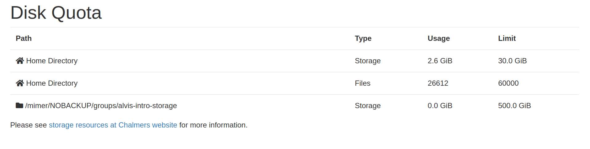

# Alvis OnDemand Dashboard DiskQuota
Alvis OnDemand dashboard app for displaying live disk quota at [Alvis OnDemand](https://portal.c3se.chalmers.se).

> **Passenger vs Dashboard app**: This is the **dashboard** version of the diskquota app! You can find the passenger plugin version at https://github.com/c3se/ood_diskquota.



## Prerequisites
This Ruby on Rails application is developed for Alvis OnDemand and relies on
(albeit few) local data containing information about quota and usage.  The app
requires `getfattr` (from the `attr`-package in EL8) to read statistics from
CephFS as well as modification of the dashboard application itself.

## Install
```
$ git clone https://github.com/c3se/ood_dashboard_diskquota.git
```
The dasboard app needs to do slight modification to the dashboard app and new
files must be added to
`ondemand/apps/dashboard/app/{models,views,controllers}/`.

Update `/var/www/ood/apps/sys/dashboard/config/routes.rb`:
```
  if Configuration.can_access_files?
  [...]
+   get "diskquota", to: "disk_quota#index"
  [...]
  end
```

Place the files inside `models`, `views` and `controllers` into the respective
`/var/www/ood/apps/sys/dashboard/app/{models,views,controllers}`.

### Adding to navigation
Adding link e.g. "Check my quota" to the navigation bar can be done by
modifying the `OodApp::links` method to concatenate an extra `OodAppLink` to
the "files" list. We do this by creating an OodApp initializer inside
`/etc/ood/apps/dashboard/initializers/`. Unfortunately we need to copy and
paste the entire class, it would seem, only to modify the link list. We would
be very happy to know if there is a more simple way to do this, while still
keeping most of the core dashboard app unmodified.

Inside e.g. `/etc/ood/apps/dashboard/initializers/ood.rb`.
```
class OodApp
  include Rails.application.routes.url_helpers 
  [...]
  # Return the links for this app based on this app's role. One app may have several links.
  #
  # @return [Array<OodAppLink>] The links for this app.
  def links
    [...]
   if role == "files"
    # assumes Home Directory is primary...
    [
      OodAppLink.new(
        title: "Home Directory",
        description: manifest.description,
        url: OodAppkit::Urls::Files.new(base_url: url).url(path: Dir.home),
        icon_uri: "fas://home",
        caption: caption,
        new_tab: open_in_new_window?
      )
    ].concat(
      OodFilesApp.new.favorite_paths.map do |favorite_path|
        OodAppLink.new(
          title: favorite_path.title || favorite_path.path.to_s,
          subtitle: favorite_path.title ? favorite_path.path.to_s : nil,
          description: manifest.description,
          url: OodAppkit::Urls::Files.new(base_url: url).url(path: favorite_path.path.to_s, fs: favorite_path.filesystem),
          icon_uri: "fas://folder",
          caption: caption,
          new_tab: open_in_new_window?
        )
      end
+   ).concat([
+     OodAppLink.new(
+       title: "Check my quota",
+       description: manifest.description,
+       url: OodAppkit.dashboard.url.to_s + "diskquota",
+       icon_uri: nil,
+       caption: caption,
+       new_tab: open_in_new_window?
+     )]
    )
[...]
```

## Customizations
You can customize the app by changing the ERB-files inside `views`.

## Debugging
User logs is found at `<ood_logs>/ondemand-nginx/<user>`, usually
`/var/log/ondemand-nginx/<user>`.
